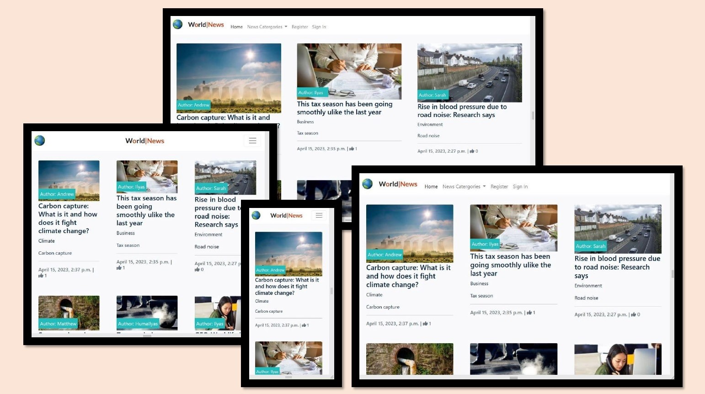
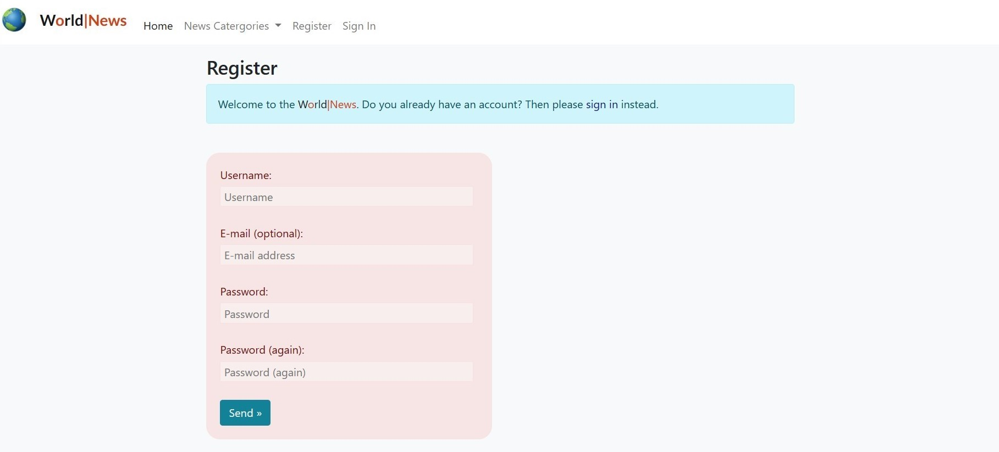
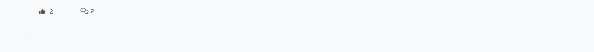
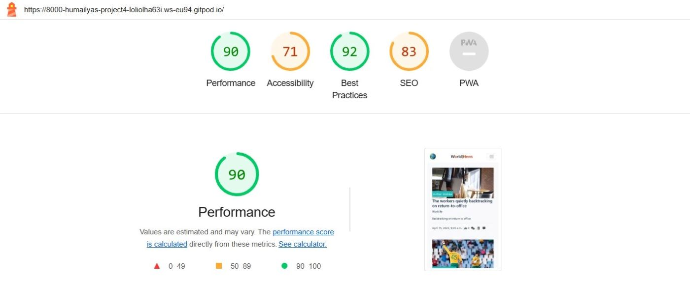

# World News
World News is a site for users who are interested in reading news of different categories. World News will keep them aware about the happenings around the world. The goal of the site is provide a platform to the users for discussion while commenting and liking or unliknig the news. 

    

## [View live website](https://project-4-world-news.herokuapp.com/)

___
# Table of contents
- [UX](#ux)
    - [Website owner goals](#website-owner-goals)
    - [User goals](#user-goals)
    - [User stories](#user-stories)
    - [Structure of the website](#structure-of-the-website)
    - [Surface](#surface)
- [Features](#features)
    - [Navigation bar](#navigation-bar)
    - [Footer](#footer)
    - [Home](#home)
    - [News categories](#news-categories)
        - [Sports](#sports)
        - [Worklife](#worklife)
        - [Climate](#climate)
        - [Science](#science)
        - [Environment](#environment)
        - [Business](#sports)
    - [News detail](#news-detail)
    - [Register](#register)
    - [Sign In](#sign-in)
    - [Sign Out](#sign-out)
    - [Like/Unlike a news post](#like-unlike-a-news-post) 
    - [Submission of comment](#submission-of-comment)
    - [Approval of comment](#approval-of-comment)
- [Technologies used](#technologies-used)
- [Testing](#testing)
    - [Automated testing](#automated-testing)
        - [Code validation](#code-validation)
        - [Performance testing](#performance-testing)
    - [Manual testing](#manual-testing)
      - [Testing User Stories](#testing-user-stories)
      - [Full Testing](#full-testing)
    - [Compatibility testing](#compatibility-testing)
    - [Functionality testing](#functionality-testing)
    - [Issues found during site development](#issues-found-during-site-development)
- [Deployment](#deployment)
- [Credits](#credits)

___
# UX

## Website owner goals
The main goals of the website owner are:
* To create a discussion community for the users.
* To provide a website for different categories of news. 
* To provide the possibilty for the users to leave their comments.
* To provide the possibilty for the users to like or unlike the news.

## User goals
The main goals of the website user are 
* To post the news.
* To read the news.
* To leave comment on the news.
* To like or unlike the news.

## User stories

### As a site user/site owner
* As a site owner I can create, read, update, and delete posts so that I can manage my news content.
* As a site owner I can categorize a post so that I and site user can view the list of posts based on their category.
* As a site owner I can create draft posts so that I can finish writing the content later on.
* As a site owner/site user I can view the number of likes on each post so that I can see which is the most popular or viral news these days.
* As a site owner/site user I can view comments on an individual post so that I can read the conversation among the community.
* As a site owner I can approve or disapprove comments on each post so that I can filter out the objectionable comments.

### As a site user
* As a site user I can view a navigation bar so that I can easily navigate around the different pages of the website.
* As a site user I can view a paginated list of posts so that I can easily select the post to view. 
* As a site user I can view the list of posts so that I can select the one to read.
* As a site user I can click on the title of the post so that I can read the full text about that news.
* As a site user I can register an account so that I can comment and like the news.
* As a site user I can leave comments on the posts so that I can be involved in the conversation with the community.
* As a site user I can like or unlike a post so that I can interact with the content and share my feelings about that news.

## Structure of the website
* The design of the website is user-friendy as this is responsive on all type of devices: desktop, laptops, tablets, ipads and mobiles.
* On all the above mentioned devices users can have a fantastic experience. 
* All parts of the website are designed to achieve maximum user satisfaction.

## Surface

### Colors
Main colours used in the development of World News:
* background color: #F9FAFC; #fff; #75dcdc; #f8f9fb; #23BBBB; 
* font color: #171719; #d14111; #171719; white; lightgray; #171719; #fff; #d6e2e2;
* link color: #052241; #13355b; #0a9292;
* link hover color: #481404; #97250e; rgb(109, 10, 10)
* button color: #138197; #585655; 
* button hover color: #094c59; #363534;
* social networks: rgb(109, 10, 10)

### Fonts 
* As a main font lato and as a backup font sans-serif are used for the contents of the website.

### Images
* Images are taken from [Google Images](https://images.google.nl/), which is credited in the [credits](#credits) section.

[Back to Table of contents](#table-of-contents)

___
# Features

## Navigation bar
The full responsive navigation bar is featured on all the pages to allow for easy navigation from page to page across all devices.
* On the left side is logo and title of the website, which can be used as navigation link to Home page.
* On the left side are also links to the Home, News categories, Register, Sign In, Sign Out.

    

## Footer
The footer section is consistent on all pages and includes links to the relevant social media sites for World News.
* The links will open in a separate tab in a browser to allow easy navigation for the users.
* The footer is useful for users to get connected with the community for socialization through social networks.

    

## Home
* The home page includes all categories of news published on World News.
* The inclusion of an eye-catching animation draws the attention of users for different caegories of news.

    

## News Categories
* Different categories of news such as sports, science, worklife, and business will appear on their respective pages. 

    

### Sports
* The news related to sports are on sports page. 

    

### Worklife
* The news related to worklife are on worklife page. 

    

### Climate
* The news related to climate are on climate page. 

    

### Science
* The news related to science are on science page. 

    

### Environment
* The news related to environment are on environment page. 

    

### Business
* The news related to business are on business page. 

    

## News detail
The users can read the detail about the news by clicking on the title of the news post. 

    

## Register
Users can register an account so that they can comment and like different categories of news posts on World News.

    

## Sign In
After registration users can sign in so that they can comment and like different categories of news on World News.

    

## Sign Out
Users can sign out if they would like to be signed out due to security reasons.

    

## Like/Unlike a news post 
After creating an account the user can like or unlike the news post by click/unclick the icon of thumb-up on the post detail page.

    

## Submission of comment 
The message of successful submission will appear on the post details page after leaving the comment on a news post.

    

## Approval of comment 
On the post details page after leaving the comment on a news, the message will appear to indicate that your comments needs approval.

    

[Back to Table of contents](#table-of-contents)

___
# Technologies used

Different technologies were used to complete the contents of World news website.

### GitHub
* As a software hosting platform to keep project in a remote location.

### Git
* As a version-control system tracking.

### Gitpod  
* As a development hosting platform.

### Codeanywhere
* As a development hosting platform.

### Heroku
* Platform as a service offering to carry out application deployment, scaling, and management.

### HTML5
* As a structure language.

### CSS
* As a style language.

### Python
*  As an interpreted, interactive, and object oriented scripting language.

### JavaScript
* As an interactivity langauage.

### Django
* As a high-level Python web framework that encourages rapid development and clean, pragmatic design.

### Postgres
* As a relational database.

### Font Awesome
* As an icon library for icons used in the World News comments and likes section, and social links.

[Back to Table of contents](#table-of-contents)

___
# Testing

## Automated testing 
The automated testing includes all the testing that is carried out by a program. World News is validated for a code using four websites ([W3C HTML Validator](https://validator.w3.org/); [W3C CSS Validator (Jigsaw)](https://jigsaw.w3.org/css-validator/); [JSHint JavaScript Validator](https://jshint.com/); [PEP8 online validator](http://pep8ci.herokuapp.com/#)), and performance was tested using [Lighthouse](https://developers.google.com/web/tools/lighthouse/) tool.

### Code validation

#### HTML
* No errors were found when passing through the official [W3C HTML Validator](https://validator.w3.org/)

#### CSS
* No errors were found when passing through the official [W3C CSS Validator (Jigsaw)](https://jigsaw.w3.org/css-validator/)

#### JavaScript
* No errors were found when passing through the official [JSHint JavaScript Validator](https://jshint.com/)

#### Python
* No errors were found when passing through the official [PEP8 online validator](http://pep8ci.herokuapp.com/#)

### Performance testing
[Lighthouse](https://developers.google.com/web/tools/lighthouse/) tool was used to check the performance of the website.
* Couple of changes were made to improve the performance.

### Final results
* The colors and fonts chosen are easy to read and accessible on desktop. 

    

* The colors and fonts chosen are easy to read and accessible on mobile.

    

## Manual testing

### Testing User Stories
World News website is meeting the needs of the [User stories](#user-stories) as described in the UX section of this README document.

#### As a site user/site owner
| Goals | Steps to achieve them |
| :--- | :--- |
| Manage posts | The site owner can create, read, update, and delete posts after login to admin account to manage the news content. The post model is created with the functions to create, read, update, and delete posts. |
| Categorize a post | In the navigation bar is a link to news categories. After clicking on that link, a list of categories will be opened for the site user/site ownner to select the list of the news posts according to their category of interest. The category model is created with the functions to select the post category. |
| Create draft posts | The site owner can create draft posts after login to admin account. The post model is created with the functions to create draft news and leave the contents to publish them later on. |
| View likes | Under each post, the total number of likes are shown on the home page, and on the pages for individaul categories of news posts so that site user/site owner can see which is the most popular or viral news these days. |
| View comments | Under each post, the total number of comments are shown on th home page. However, to see the list of the approved comments, the site user should open the detail of the news post by clicking on the tilte of the post; so that site user can read the conversation among the community. Under the details of the news post, on left side is the list of the comments and on the right side is the comment box to leave the comment. |
| Approve comments | The site owner can approve or disapprove comments on each post to filter out the objectionable comments after login to admin account. The comment model is created with the functions to approve or disapprove comments. The approved comments will be shown on the post detail page. |

#### As a site user
| Goals | Steps to achieve them |
| :--- | :--- |
| Easy navigation | A navigation bar is provided for site user on each page to easily navigate around the different pages of the website. |
| Site pagination | Site user can view a paginated list of posts on the home page and on the pages for individaul categories of news posts to easily select a post to view. |
| View post list | Site user can view the list of posts on the home page and on the pages for individaul categories of news posts to select the one to read. |
| Open a post | Site user can click on the title of the news post to read the detail about that news post. |
| Account registration | In the navigation bar is a link to register an account so that site user can leave a comment and like or unlike the news post. |
| Comment on a post | After creating an account the site user can leave a comment on the news post in the comments section on the post detail page to be involved in the conversation with the community. |
| Like/Unlike a post | After creating an account the site user can like or unlike the news post by clicking on the icon of thumb-up on the post detail page to interact with the content and to share his/her feelings about that news. |

- - -